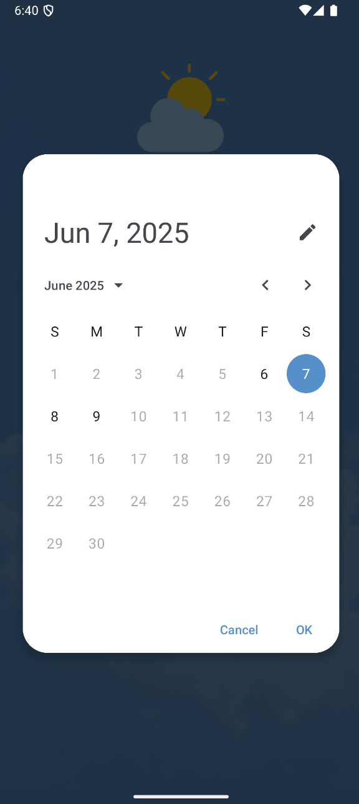
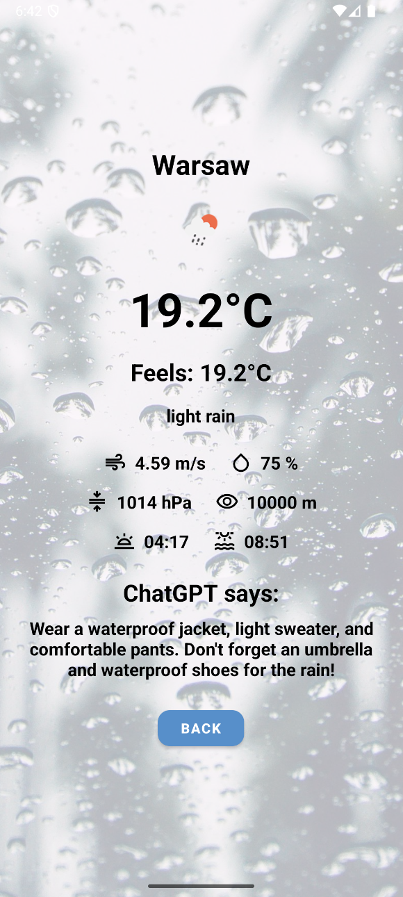

# AI powered Java Android Application

Weather Forecast AI powered solution built using Java for the Android platform to search forecast weather.

## Screenshots

  
  

## Technologies

## Authors

[Vladyslav Babiak - Developer](https://github.com/Vladosik12333)

## Copyright & Licensing Information

[MIT License](LICENSE)
